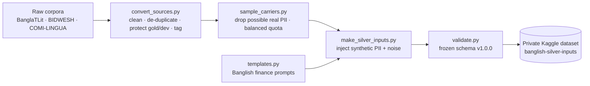

# PII injection and preprocessing pipeline

**Owner:** Himel Saha (Pii+preprocssing) · **Proposal v2:** §3.1–3.4, §2.1, §4.6 rule 1, §6.1 · **Status:** silver inputs v0 done

This pipeline turns raw corpora into **silver inputs**: prompts with synthetic PII at exact
character offsets, which the teacher ensemble will label (§3.2 step 5). It also sets aside the
pools from which the human gold sets are drawn, and keeps them out of training (§3.4).

> Silver inputs are **inputs, not answers**. They contain no normalization, uncertainty scores or
> routing; those come from the teachers (§4). They are never gold data.

## Pipeline



## What is in this directory tree

| Path | What it does |
|---|---|
| `src/pii_inject/generators.py` | Synthetic values for all 10 schema PII types and their rendering in three regimes |
| `src/pii_inject/templates.py` | 24 Banglish finance templates and 12 PII clauses for real sentences |
| `src/pii_inject/build.py` | Builds records from segments so offsets are exact; makes a schema-valid PII-only reference |
| `src/noise/noise.py` | Typos, Banglish spelling variation, OCR confusions, amount noise (`500` → `5oo`) |
| `scripts/convert_sources.py` | Raw corpora → carrier JSONL; cleaning, de-duplication, gold/dev protection, hate-row filter, merge |
| `scripts/sample_carriers.py` | Drops lines that may contain real PII; balanced sample per source and dialect |
| `scripts/make_silver_inputs.py` | Generates silver inputs in template mode and carrier mode |
| `tests/test_pii_inject.py`, `tests/test_sample_carriers.py` | Formats, Luhn, offsets, regimes, schema validity, filtering, quotas |
| `configs/schema.json`, `src/common/validate.py`, `tests/test_schema.py` | Frozen schema v1.0.0 and its validator, copied unchanged from tag `schema-v1.0.0` |
| `docs/env_checks/himel.json` | Kaggle environment check: 3/3 schema-valid outputs on T4 with vLLM 0.30.0 |

## How to run it

CPU is enough; no GPU is needed anywhere in this pipeline.

```bash
pip install -r requirements.txt
python -m pytest -q tests/

# 1. raw sources (BanglaTLit is MIT-licensed on GitHub; COMI-LINGUA is CC-BY-4.0 on Hugging Face;
#    BIDWESH comes from Mendeley Data and is placed in raw_sources/BIDWESH/ by hand)
git clone --depth 1 https://github.com/farhanishmam/BanglaTLit.git raw_sources/BanglaTLit

# 2. clean, de-duplicate, protect gold/dev pools, merge
python scripts/convert_sources.py --raw raw_sources --out carriers --sources banglatlit,bidwesh,comilingua --merge

# 3. drop possible real PII, balanced sample
python scripts/sample_carriers.py --inp carriers/merged_silver.jsonl --out carriers/carrier_sample_v0.jsonl \
    --quota BanglaTLit=20000,BIDWESH=5000 --seed 0

# 4. generate silver inputs
python scripts/make_silver_inputs.py --n-template 5000 --seed 1 --member himel --with-reference \
    --out silver/inputs_template_v0.jsonl
python scripts/make_silver_inputs.py --carrier carriers/carrier_sample_v0.jsonl --seed 2 --member himel \
    --with-reference --out silver/inputs_carrier_v0.jsonl
```

Raw and generated data are never committed; they live in private Kaggle datasets.

## Output record

```json
{
  "id": "BanglaTLit-btlpt-000001-pii000000",
  "source": "BanglaTLit", "split": "silver", "surface_form": "romanized", "dialect": null,
  "input": "kal theke net nai bhai. amar number 01712345678",
  "pii": [{"type": "PHONE", "span": "01712345678", "start": 36, "end": 47,
           "canonical": "01712345678", "regime": "canonical"}],
  "preserved_entities": [],
  "hints": [],
  "meta": {"generator": "pii_inject-0.1.0", "seed": 2, "synthetic": "pii_only", "member": "himel"},
  "pii_reference": {"sanitized_prompt": "kal theke net nai bhai. amar number <PHONE_1>", "...": "..."}
}
```

`input[start:end] == span` holds for every entity (tested). `synthetic` is `true` for template
records and `"pii_only"` for real sentences with synthetic PII.

## Design decisions

- **PII types come from the frozen schema** (PHONE, NID, ID_NUMBER, ACCOUNT_NUMBER, CARD_NUMBER,
  TXN_ID, OTP, EMAIL, PERSON_NAME, ADDRESS), so every output is checked by the shared validator.
- **Three regimes, labelled exactly** (§3.2 step 2): *canonical* `01712345678`; *spoken*
  `zero one seven …` or `shunno ek shat …`; *perturbed* delimiters, digit–letter swaps,
  Bangla-script digits, attached postpositions (`01712345678e`). Leakage is reported per regime (§6.1).
- **Offsets by construction:** noise is applied to segments before joining, and offsets are computed
  while joining, so noise can never shift a span away from its offsets.
- **Precedence rules (§2.1) as hints:** a bare identifier gets a `PII_BOUNDARY` hint; an amount like
  `5oo tk` gets a `NUMERIC_AMBIGUITY` hint.
- **Minimal cleaning:** Unicode NFC, zero-width characters, whitespace, URLs. Spelling noise is kept,
  because the model must learn to handle it.
- **Gold protection:** BanglaTLit's pre-training corpus contains its test sentences; 9,530 lines that
  matched gold or dev text are removed from silver.

## Silver inputs v0 (27 September 2026)

| | |
|---|---|
| Template records | 5,000 (seed 1) |
| Carrier records | 20,000 BanglaTLit sentences (seed 2), after dropping 736 lines with possible real PII |
| Schema validity | 0 invalid of 25,000 |
| BanglaTLit pools | gold 2,477 · dev 1,494 · silver 229,665 |
| Storage | private Kaggle dataset `banglish-silver-inputs` |

## Open points for the team

- Confirm the split: BanglaTLit test = gold pool, val = dev pool, train + PT = silver.
- Confirm the real-PII filter until the regex detector replaces it.
- A native speaker should review `src/pii_inject/templates.py` and add dialect variants.
- Verify the formats marked `VERIFY` in `generators.py` (bKash/Nagad/Rocket transaction IDs, account lengths).
- `main` organises code as `src/pii/` and `src/preprocessing/`; the modules here follow the
  schema skeleton (`src/pii_inject/`, `src/noise/`) and can be moved if the team prefers.

## Next steps

1. Regex PII detector: baseline B1, runtime rule 1, per-regime recall (§4.6, §5, K4).
2. Dialect text: 5-Dialects-BN (Romanized dialects) and BIDWESH → silver inputs v1 (§3.1, §3.2).
3. 8-gram and MinHash contamination filter against all gold and dev pools (§3.4).
4. About 5,000 Hinglish inputs from COMI-LINGUA (§3.2, RQ4).
5. BanglishRev real-PII evaluation slice, only after ethics approval (§3.1, §6.1).
