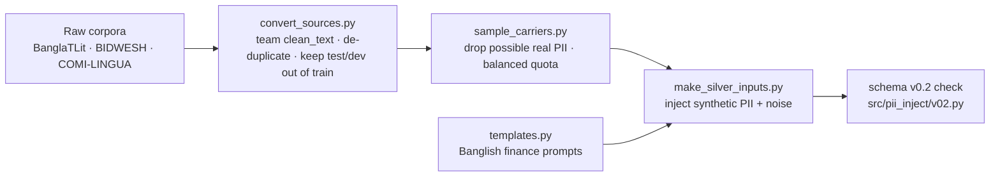

# PII injection pipeline

**Owner:** Himel Saha (PII + preprocessing) · **Dataset and schema v0.2:** Saber ·
**Proposal v2:** §3.1–3.4, §2.1, §6.1 · **Status:** ready for review

This pipeline adds **synthetic PII at known character positions** to real Banglish text and to
Banglish finance templates. The output records follow the team schema v0.2
(`docs/annotation-schema.md`) and are **inputs for the teacher ensemble** (§3.2 step 5).
Because we inserted the PII ourselves, we know exactly where it is, which later lets us measure
PII leakage per formatting regime (§6.1).

**Who does what:** this pipeline *injects* PII (it creates data). PII *detection* is Sadat's regex
baseline (B1, PR #24); these records are what that detector is tested on.

## Pipeline



## Files

| Path | What it does |
|---|---|
| `src/pii_inject/generators.py` | Synthetic values for the 10 schema v0.2 PII types, rendered in three regimes |
| `src/pii_inject/templates.py` | 24 Banglish finance templates and 12 PII clauses for real sentences |
| `src/pii_inject/build.py` | Builds schema v0.2 records; offsets exact by construction; same value → same placeholder |
| `src/pii_inject/v02.py` | The schema v0.2 rules this pipeline produces, and a record checker |
| `src/noise/noise.py` | Typos, Banglish spelling variation, OCR confusions, amount noise (`500` → `5oo`) |
| `scripts/convert_sources.py` | Raw corpora → carriers, using the team's `clean_text()`; splits named train/dev/test as in `prepare_banglatlit.py` |
| `scripts/sample_carriers.py` | Drops lines that may contain real PII; balanced sample per source and dialect |
| `scripts/make_silver_inputs.py` | Generates the records and checks every one against schema v0.2 |
| `tests/test_pii_inject.py`, `tests/test_sample_carriers.py` | 22 tests, including one that reads the PII type list from `docs/annotation-schema.md` |

## PII types (confirmed by Himel)

PHONE, NID, ID_NUMBER, TXN_ID, ACCOUNT, CARD, OTP, EMAIL, NAME, ADDRESS — exactly the list in
schema v0.2. A test fails if the code and the schema doc ever disagree.

## Formatting regimes (§3.2 step 2)

| Regime | Example |
|---|---|
| canonical | `01712345678`, `4539 1488 0343 6467` |
| spoken | `zero one seven ...`, `shunno ek shat ...` |
| perturbed | `017-123-45678`, `O1712345678`, `০১৭১২৩৪৫৬৭৮`, `01712345678e` |

## Example record (schema v0.2)

```json
{
  "id": "BG_PII_000000",
  "schema_version": "0.2",
  "input": "Amaro marshmallow kintu nai account 8234152879109",
  "clean_input": "Amaro marshmallow kintu nai account 8234152879109",
  "normalized_text": null,
  "sanitized_prompt": null,
  "pii": [{"type": "ACCOUNT", "placeholder": "<ACCOUNT_1>", "text": "8234152879109",
           "start": 36, "end": 49, "regime": "canonical"}],
  "preserved_entities": [],
  "uncertainties": [],
  "routing": null,
  "metadata": {"language": "banglish", "surface_form": "banglish", "source": "BanglaTLit",
               "label_source": "none", "split": "train", "source_id": "c262d6b2-...",
               "generator": "pii_inject-0.2.0", "seed": 2, "hints": [], "noise_applied": []}
}
```

Generated text is already clean (`clean_text(input) == input`), so `input` and `clean_input` are the
same and the offsets are valid for both. `normalized_text`, `sanitized_prompt`, `uncertainties`
and `routing` are left for the teachers.

## Proposed conventions — for Saber to approve

| Topic | Proposal | Why |
|---|---|---|
| IDs | `BG_SYN_000001` (template), `BG_PII_000001` / `HG_PII_000001` (real text + synthetic PII) | Avoids collisions with `BG_000001` from `prepare_banglatlit.py` |
| label_source | `synthetic` for templates; `none` for real text sent to the teachers | Matches the label_source table; injected PII is kept in `pii` as known ground truth |
| `pii[].regime` | optional key: canonical / spoken / perturbed | Needed for per-regime leakage (§6.1); other code ignores extra keys |
| surface_form | BanglaTLit → `banglish`, BIDWESH → `dialect`, COMI-LINGUA → `hinglish` | Same as `prepare_banglatlit.py` |
| extra metadata | `source_id`, `generator`, `seed`, `hints`, `noise_applied` | Reproducibility; `prepare_banglatlit.py` also adds extra metadata keys |

## How to run (CPU only)

```bash
pip install -r requirements.txt
python -m pytest -q tests/test_pii_inject.py tests/test_sample_carriers.py

git clone --depth 1 https://github.com/farhanishmam/BanglaTLit.git raw_sources/BanglaTLit
python scripts/convert_sources.py --raw raw_sources --out carriers --sources banglatlit,bidwesh,comilingua --merge
python scripts/sample_carriers.py --inp carriers/merged_train.jsonl --out carriers/carrier_sample.jsonl \
    --quota BanglaTLit=20000,BIDWESH=5000 --seed 0
python scripts/make_silver_inputs.py --n-template 5000 --seed 1 --member himel --out silver/inputs_template.jsonl
python scripts/make_silver_inputs.py --carrier carriers/carrier_sample.jsonl --seed 2 --member himel \
    --out silver/inputs_carrier.jsonl
```

Data is never committed; generated files go to a private Kaggle dataset.

## Results on BanglaTLit (seeds 0, 1, 2)

| | |
|---|---|
| BanglaTLit after conversion | test 2,477 · dev 1,494 · train 229,665 (9,530 train lines matching test/dev removed) |
| Real-PII filter | 743 lines dropped |
| Template records | 5,000, all pass the schema v0.2 check |
| Carrier records | 20,000, all pass the schema v0.2 check |

## Open points

- Saber: approve or change the proposed conventions above.
- A native speaker should review `src/pii_inject/templates.py` and add dialect variants.
- Verify the formats marked `VERIFY` in `generators.py` (bKash/Nagad/Rocket transaction IDs, account lengths).
- Module location: `src/pii_inject/` and `src/noise/` could move under `src/pii/` / `src/preprocessing/` if preferred.

## Next steps

1. Measure Sadat's regex baseline (#24) per regime on these records (B1, K4).
2. Replace the strict real-PII filter with that detector once #24 is merged.
3. Dialect text (5-Dialects-BN, BIDWESH) and ~5,000 Hinglish inputs.
4. 8-gram and MinHash overlap filter against all test and dev data (§3.4).
