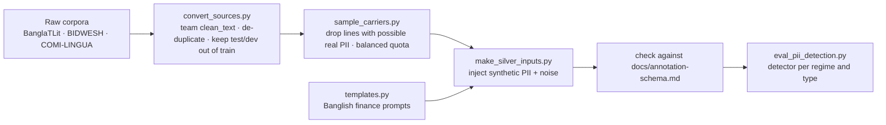

# PII module

**Owner:** Himel Saha (PII + preprocessing) · backup: Saber (per `docs/status.md`) ·
**Schema v0.2 and dataset:** Saber · **Proposal v2:** §2.1, §3.2, §4.6 rule 1, §6.1

The PII module has two parts:

| Part | What it does | Code |
|---|---|---|
| **Detection and masking** | Finds PII in a prompt and replaces it with `<TYPE_N>` placeholders. This is the "PII Masking" stage of the pipeline in `README.md` and the deterministic regex check of proposal §4.6 rule 1 | `src/pii/detect.py` |
| **Injection** | Puts synthetic PII at known positions into real Banglish text and finance templates, producing schema v0.2 records for the teachers and for testing detection | `src/pii/inject.py`, `generators.py`, `templates.py` |

**Relation to the regex baseline B1 (Sadat, PR #24):** B1 in `src/baselines/` is the *comparison*
system of the evaluation (proposal §5). `src/pii/detect.py` is the *pipeline component*. Whether B1
should reuse this detector or stay independent is for Sadat and the team to decide.

**Schema:** the team document `docs/annotation-schema.md` is the only schema. `src/pii/schema.py`
reads every allowed value (PII types, surface forms, label sources, splits, routes, fields) from
that document at import time, so there is no second copy. If the document changes, the code follows.

## Detection

```python
from src.pii.detect import detect, mask
text = "kalk3 bkash e 5oo tk send korsi trans id 9X87K, taka pay nai. 1987654321 eta check koren"
masked, pii = mask(text, detect(text))
# kalk3 bkash e 5oo tk send korsi trans id <TXN_ID_1>, taka pay nai. <ID_NUMBER_1> eta check koren
```

It handles the formats Romanized Bangla uses: Bangla digits, look-alike letters next to digits
(`O17l2345678`), delimiters (`017-123-45678`, `4539 1488 0343 6467`), spoken numbers in English or
Banglish (`shunno ek shat ...`), postpositions glued to a value (`01712345678e`), and misspelled
context words (`TxrID`, `naarn`). Amounts (`500 tk`, `5oo taka`) are never masked.

Types follow the precedence rules of proposal §2.1: a context word in the same clause decides the
type (NID, account, OTP, transaction ID, card); a phone-shaped number is PHONE; a Luhn-valid
16-digit number is CARD; any other digit string of 10+ digits is ID_NUMBER, masked conservatively.
For glued postpositions the masker errs towards covering one extra letter rather than leaving part
of a value visible.

### Results on injected records

Records: 25,000 · gold PII spans: 25,625 · predicted spans: 25,639

**Overall:** found 93.1% · leaked 0.4% · precision 93.0%

#### By formatting regime

| regime | spans | found | type ok | leaked |
|---|---:|---:|---:|---:|
| canonical | 12,544 | 97.5% | 99.6% | 0.2% |
| spoken | 4,229 | 99.9% | 99.5% | 0.1% |
| perturbed | 8,852 | 83.5% | 99.5% | 1.0% |

#### By PII type

| type | spans | found | type ok | leaked |
|---|---:|---:|---:|---:|
| ACCOUNT | 2,107 | 99.4% | 95.9% | 0.2% |
| ADDRESS | 1,875 | 56.2% | 100.0% | 0.0% |
| CARD | 2,075 | 99.5% | 100.0% | 0.3% |
| EMAIL | 1,873 | 100.0% | 100.0% | 0.0% |
| ID_NUMBER | 2,079 | 99.9% | 100.0% | 0.1% |
| NAME | 2,168 | 66.3% | 100.0% | 0.0% |
| NID | 3,707 | 99.6% | 99.7% | 0.2% |
| OTP | 2,015 | 98.8% | 100.0% | 1.1% |
| PHONE | 5,005 | 99.9% | 100.0% | 0.1% |
| TXN_ID | 2,721 | 94.4% | 99.6% | 2.4% |


"found" = exact start and end; "leaked" = at least one character of the PII left unmasked (any type
counts as masked; this is the leakage rate of §6.1).

**Read these numbers as an optimistic upper bound.** The records come from our own generator, and the
detector was written knowing its formats. They are useful for comparing regimes and types, not as a
result for the paper; the real test is the human gold set and the BanglishRev real-PII slice.
Known weak spots: names are found only with a context word and capital letters (lowercase names in
real text will be missed), and addresses only in the "house N, road N, Area, City" form.

## Injection



Synthetic PII comes in three regimes (§3.2 step 2): **canonical** `01712345678`; **spoken**
`zero one seven ...`, `shunno ek shat ...`; **perturbed** `017-123-45678`, `O1712345678`,
`০১৭১২৩৪৫৬৭৮`, `01712345678e`. Generated text is already clean (`clean_text(input) == input`), so
`clean_input[start:end] == text` holds for every PII span.

Example record (schema v0.2):

```json
{"id": "BG_PII_000000", "schema_version": "0.2",
 "input": "Amaro marshmallow kintu nai account 8234152879109",
 "clean_input": "Amaro marshmallow kintu nai account 8234152879109",
 "normalized_text": null, "sanitized_prompt": null,
 "pii": [{"type": "ACCOUNT", "placeholder": "<ACCOUNT_1>", "text": "8234152879109",
          "start": 36, "end": 49, "regime": "canonical"}],
 "preserved_entities": [], "uncertainties": [], "routing": null,
 "metadata": {"language": "banglish", "surface_form": "banglish", "source": "BanglaTLit",
              "label_source": "none", "split": "train", "source_id": "c262d6b2-...",
              "generator": "pii-inject-0.3.0", "seed": 2, "hints": [], "noise_applied": []}}
```

## Files

| Path | What it does |
|---|---|
| `src/pii/detect.py` | Rule-based detector and `<TYPE_N>` masker |
| `src/pii/schema.py` | Reads schema v0.2 rules from `docs/annotation-schema.md`; record checker |
| `src/pii/generators.py`, `src/pii/templates.py` | Synthetic PII values in three regimes; 24 Banglish finance templates |
| `src/pii/inject.py` | Builds schema v0.2 records with exact offsets |
| `src/preprocessing/noise.py` | Typos, Banglish spelling variation, OCR confusions, amount noise |
| `scripts/convert_sources.py` | Raw corpora to carriers with the team `clean_text()`; train/dev/test as in `prepare_banglatlit.py` |
| `scripts/sample_carriers.py` | Drops lines the detector (or a strict pattern) flags as possible real PII; balanced sample |
| `scripts/make_silver_inputs.py` | Generates records; checks every one against the schema document |
| `scripts/eval_pii_detection.py` | Detector recall, type accuracy and leakage per regime and type |
| `tests/test_pii_detect.py`, `tests/test_pii_inject.py`, `tests/test_sample_carriers.py` | 47 tests |

## How to run (CPU only)

```bash
pip install -r requirements.txt
python -m pytest -q tests/test_pii_detect.py tests/test_pii_inject.py tests/test_sample_carriers.py

git clone --depth 1 https://github.com/farhanishmam/BanglaTLit.git raw_sources/BanglaTLit
python scripts/convert_sources.py --raw raw_sources --out carriers --sources banglatlit,bidwesh,comilingua --merge
python scripts/sample_carriers.py --inp carriers/merged_train.jsonl --out carriers/carrier_sample.jsonl \
    --quota BanglaTLit=20000,BIDWESH=5000 --seed 0
python scripts/make_silver_inputs.py --n-template 5000 --seed 1 --member himel --out silver/inputs_template.jsonl
python scripts/make_silver_inputs.py --carrier carriers/carrier_sample.jsonl --seed 2 --member himel \
    --out silver/inputs_carrier.jsonl
python scripts/eval_pii_detection.py silver/inputs_template.jsonl silver/inputs_carrier.jsonl
```

Data is never committed; generated files go to a private Kaggle dataset.

## Proposed conventions — for Saber to approve

| Topic | Proposal | Why |
|---|---|---|
| IDs | `BG_SYN_000001` (template), `BG_PII_000001` / `HG_PII_000001` | Avoids collisions with `BG_000001` from `prepare_banglatlit.py` |
| label_source | `synthetic` for templates; `none` for real text sent to the teachers | Injected PII is kept in `pii` as known ground truth |
| `pii[].regime` | optional key: canonical / spoken / perturbed | Needed for per-regime leakage (§6.1); other code ignores extra keys |
| surface_form | BanglaTLit → `banglish`, BIDWESH → `dialect`, COMI-LINGUA → `hinglish` | Same as `prepare_banglatlit.py` |

## Next steps

1. Run the detector on the gold set once annotated (the real measurement), and on the BanglishRev
   real-PII slice after ethics approval.
2. Agree with Sadat how B1 and this detector relate, and compare them per regime.
3. Dialect text (5-Dialects-BN, BIDWESH) and ~5,000 Hinglish inputs.
4. 8-gram and MinHash overlap filter against all test and dev data (§3.4).
